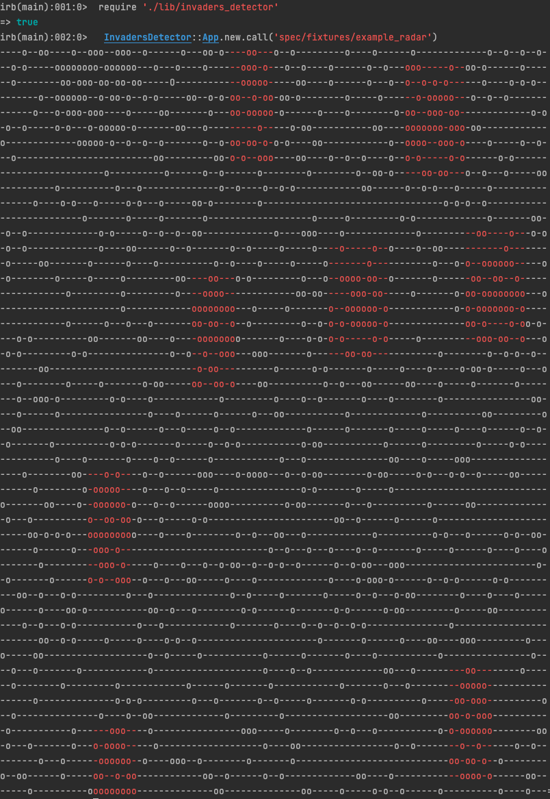

## Invaders Detector
**Warning!** this is a very serious tool for locating enemy invaders. Do **NOT** under any circumstances give this to children

## Getting Started
### Prerequisites
* ruby

### Usage
```bash
  InvadersDetector::App.new.call('spec/fixtures/example_radar')
```

### Example results



## Roadmap

- [x] Add searching objects
- [x] Add identifying invaders
- [x] Add displaying results
- [ ] Code refinements
- [ ] Add more tests for edge cases
- [ ] Add validations
- [ ] Improve the Readme file
- [ ] Localize and destroy invaders
